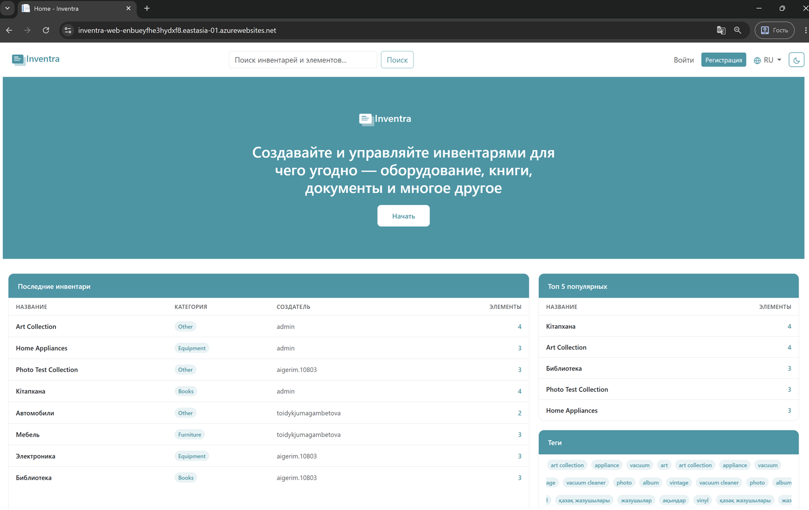
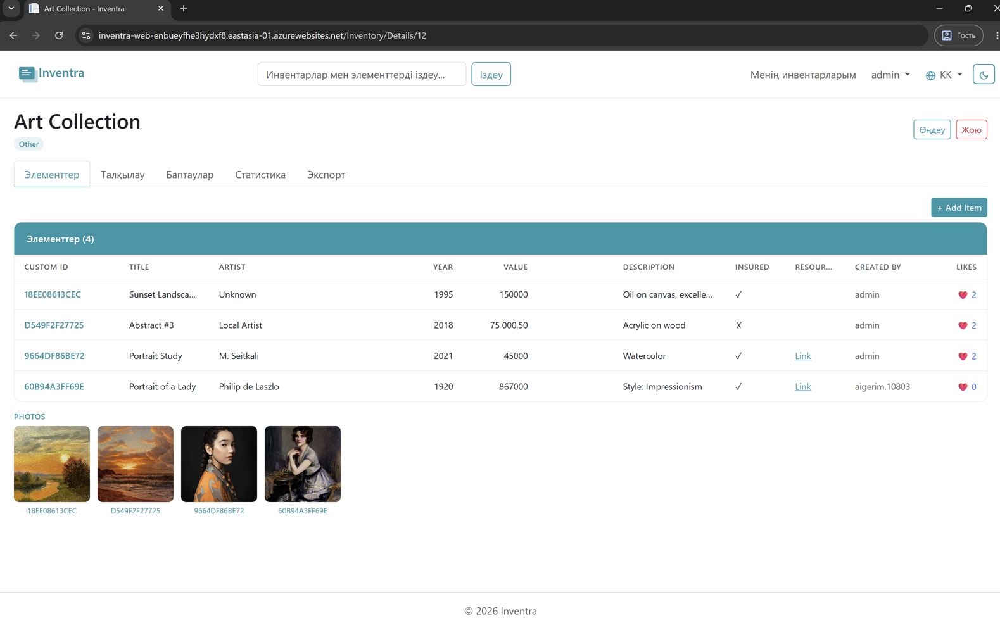
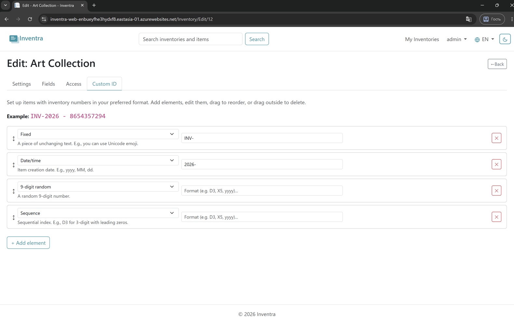
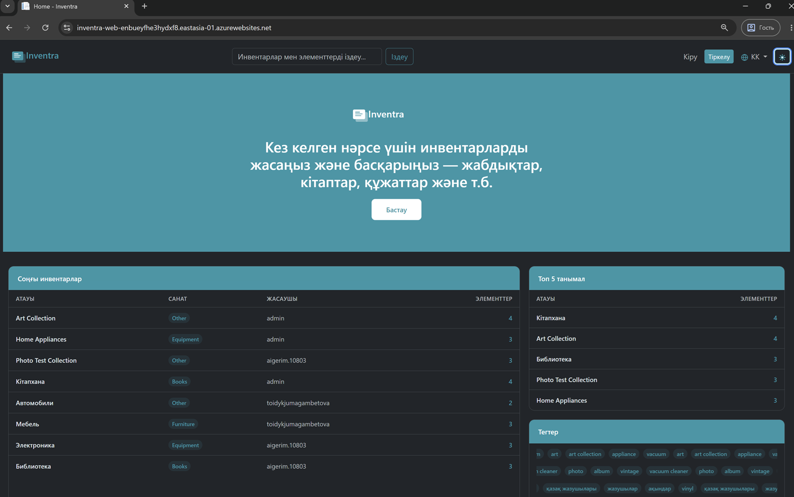

# Inventra

Web application for inventory management built with ASP.NET Core MVC and Clean Architecture.

## 🚀 Live Demo

[https://inventra-web-enbueyfhe3hydxf8.eastasia-01.azurewebsites.net](https://inventra-web-enbueyfhe3hydxf8.eastasia-01.azurewebsites.net)

## 📸 Screenshots

| Home Page | Inventory Details |
|-----------|------------------|
|  |  |

| Custom ID Editor | Dark Theme |
|-----------------|------------|
|  |  |

**Responsive Design (Mobile)**


## 🛠 Tech Stack

- **Backend:** ASP.NET Core MVC (.NET 10)
- **Database:** MS SQL Server + Entity Framework Core
- **Architecture:** Clean Architecture + CQRS (MediatR)
- **Frontend:** Bootstrap 5 + jQuery + SignalR
- **Validation:** FluentValidation
- **Mapping:** AutoMapper
- **Markdown:** Markdig
- **Cloud Storage:** Cloudinary
- **Email:** Brevo SMTP
- **Real-time:** SignalR
- **Documentation:** Swagger (OpenAPI 3.0)

## 🏗 Architecture
Inventra/
├── Inventra.Domain/         # Entities, Value Objects, Interfaces
├── Inventra.Application/    # CQRS Commands/Queries, DTOs, Behaviors
├── Inventra.Infrastructure/ # EF Core, Repositories, External Services
├── Inventra.Web/            # MVC Controllers, Views, Middleware
└── Inventra.Tests/          # xUnit Tests (48 tests)

### MediatR Pipeline Behaviors
Request → LoggingBehavior → ValidationBehavior → Handler

## ✨ Key Features

### Custom Inventories
- Create inventories with up to 15 custom fields (string, number, text, boolean, link)
- Each inventory has its own field definitions and access control
- Public inventories (any authenticated user can add items) or private with explicit user list

### Custom ID Format
- Configure ID format via drag-and-drop interface
- Supported elements: Fixed text, DateTime, Sequence, Random (20/32-bit, 6/9-digit), GUID
- Real-time preview of generated ID
- Uniqueness enforced at database level via composite index `(InventoryId, CustomId)`

### Optimistic Locking
- `rowversion` field in MS SQL for `Inventories` and `Items`
- Concurrency conflict detection via `DbUpdateConcurrencyException`
- Auto-save every 7-10 seconds with version tracking
- User-friendly conflict messages

### Real-time Comments
- SignalR WebSocket connection
- Comments appear within 1-2 seconds for all users on the page
- Markdown formatting support

### Authentication
- OAuth via Google and GitHub
- Email/password registration with email confirmation via Brevo
- Admin panel: view, block/unblock, delete users, manage roles
- Admin can remove admin role from themselves

### Localization
- Three languages: English, Kazakh, Russian
- Light/Dark theme
- Preferences saved in cookies

## 🔍 Full-Text Search

The application supports two search modes controlled by a feature flag.

### Configuration
In `appsettings.json`:
```json
{
  "Search": {
    "UseFullText": false
  }
}
```

| Mode | Flag | SQL Query | Performance |
|------|------|-----------|-------------|
| Local development | `false` | `LIKE '%query%'` | Simple, no setup needed |
| Azure production | `true` | `CONTAINS(column, 'query')` | Fast, relevance ranking |

### How it works

**LIKE mode** (local) — SQL Server scans every row checking if it contains the search term. Simple but slow on large datasets.

**Full-Text Search mode** (Azure) — SQL Server uses a pre-built index of all words. Much faster on large datasets, supports relevance ranking.

### FTS Setup on Azure SQL

Full-Text Search requires a separate setup because SQL Server does not allow `CREATE FULLTEXT CATALOG` inside a transaction (which EF Core migrations use).

The following script was executed manually on Azure SQL:

```sql
CREATE FULLTEXT CATALOG InventraFtsCatalog AS DEFAULT;
```

### FTS Indexes configured on Azure

| Table | Columns |
|-------|---------|
| Inventories | Title, Description |
| Items | CustomId, CustomString1-3Value, CustomText1-3Value |

### Enabling FTS on Azure
In Azure Portal → App Service → Configuration → Application Settings:
Search__UseFullText = true

### Fallback mechanism
If Full-Text Search fails, the application automatically falls back to `LIKE` search and logs a warning — no downtime for users.

## 📋 Prerequisites

- [.NET 10 SDK](https://dotnet.microsoft.com/)
- [MS SQL Server](https://www.microsoft.com/sql-server/) (LocalDB or Azure SQL)

## 🏃 Local Development

1. Clone the repository
2. Update connection string in `appsettings.Development.json`
3. Add admin credentials to `appsettings.Development.json`:
```json
{
  "AdminSettings": {
    "Email": "admin@example.com",
    "UserName": "admin",
    "Password": "YourPassword123!"
  }
}
```
4. Run migrations:
```bash
dotnet ef database update --project Inventra.Infrastructure --startup-project Inventra.Web
```
5. Run the app:
```bash
cd Inventra.Web
dotnet run
```
6. Open `https://localhost:7113`
7. Swagger UI available at `https://localhost:7113/swagger`

## ⚙️ Configuration

Copy `appsettings.Development.json` and fill in:
- `ConnectionStrings:DefaultConnection` — MS SQL connection string
- `AdminSettings` — admin credentials
- `Cloudinary` — cloud image storage credentials
- `Authentication:Google` and `Authentication:GitHub` — OAuth credentials
- `Brevo` — SMTP email credentials
- `Search:UseFullText` — `false` for local, `true` for Azure

## 🗄 Database Schema

Key tables:
- `Inventories` — inventory definitions + custom field settings
- `Items` — inventory items with values for custom fields
- `CustomIdFormats` / `CustomIdElements` — ID format configuration
- `InventoryAccess` — user access list for private inventories
- `InventorySequences` — atomic sequence counter for custom IDs
- `Comments` — real-time discussions via SignalR
- `Likes` — one like per user per item

## 🧪 Tests

```bash
dotnet test
```

48 tests covering:
- Inventory creation and validation
- Custom ID generation (sequence, random, datetime elements)
- Full-text and LIKE search
- Inventory statistics aggregation
- Permission service
- Home controller integration

## 📖 API Documentation

Swagger UI available locally at `/swagger`.

## 🚀 Deployment

Deployed on **Azure App Service** with **Azure SQL Database**.

CI/CD via **GitHub Actions** — every push to `main` deploys automatically.

### Azure Services Used
- Azure App Service (Linux, .NET 10)
- Azure SQL Database (General Purpose, Serverless)
- Cloudinary (image storage)

## 📄 License

Educational project — Itransition Internship 2026
